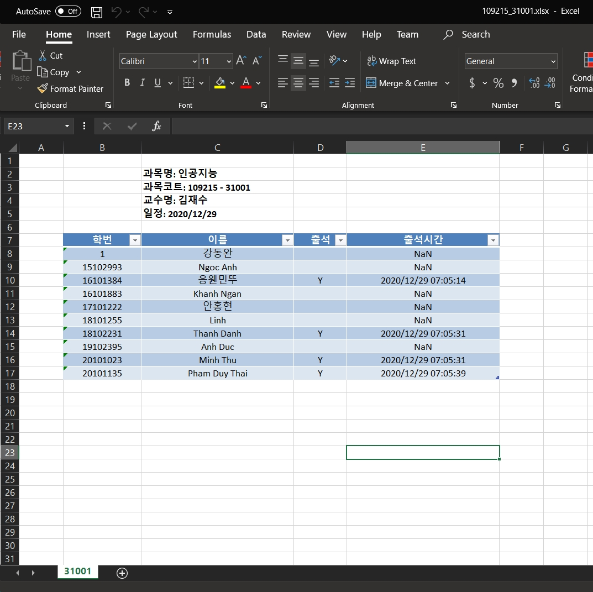

# 컴퓨터공학과 졸업작품 - Capstone Project
# Attendance Management System for Online lecture Platform (AMSOP)
**Developers**
- **16101384 Minh Tu 응웬민뚜**
- **17101222 안홍현**

**Demo video** [here](https://www.youtube.com/watch?v=Lo8AveJxBOQ)
## Features

A tool for automatically checking attendance of students in a class during online meeting, based on face recognition algorithm.

We believe this time-saving tool can help teachers, professors and meeting hosts manage the attendance list more efficiently.

**Input: Frame from screen**


**Output: Attendance list in .xlsx format**




## Requirements 

  * Python 3.3+
  * [**CMake**](https://cmake.org/download/) if using Windows OS
  * [**PIL**](https://wp.stolaf.edu/it/installing-pil-pillow-cimage-on-windows-and-mac/)
  * [**dlib**](http://dlib.net/)
  ```bash
  pip install dlib
  ```
  * [**face_recognition**](https://github.com/ageitgey/face_recognition) (requires dlib)
  ```bash
  pip install face_recognition
  ```
  * [**pandas**](https://github.com/pandas-dev/pandas)
  ```bash
  pip install pandas
  ```
  * [**argparse**](https://docs.python.org/3/library/argparse.html)
   ```bash
  pip install argparse
  ```
  * [**keyboard**](https://pypi.org/project/keyboard/)
   ```bash
  pip install keyboard
  ```
  
## Usage
### Command-Line Interface

**Here is the summary for the required arguments**
```bash
  --course_id        Course code 과목코트
  --lecture_id       Lecture code 강좌번호
```

By default, the attendance record is sorted by name.

However, there are other optional criteria such as by student ID or by attendance time.


**Optional arguments**
```bash
  -h, --help         show help message and exit
  --path 	     Path to students images data set (default: /student_images)
  --sort_by_id       Sort in ascending order of student ID
  --sort_by_time     Sort in ascending order of attendance time
  --reverse          Reverse the list (default: False)
  --ofile            Output .xlsx file name (default: 과목코트_강좌번호)
```

Students' image folder directory structure

```
<path>
	|
	|_강동완_1.jpg
	|
	|_안홍현_17101222.jpeg
	|
	|_응웬민뚜_16101384.jpg
	|

```

The student images should have the form of ***name_id*** such as ***응웬민뚜_16101384.jpg***

**Run from command line**

Below is an example of executing attendance check on **Course 109215 인공지능 Class 31001**.

You could terminate the program by pressing *Esc*.

```bash
$ python3 attendance.py --course_id 109215 --lecture_id 31001 --sort_by_time
```